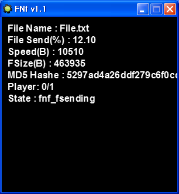

# FN File Send Scripts

서버가 접속한 클라이언트 전부에게 파일을 보내 주는 게임메이커 8 스크립트 모음이다. Faucet Networking 소켓 위에서 파일을 조각으로 나눠 보내고, 받는 쪽의 응답 속도에 맞춰 조각 크기를 조절하며, 다 받으면 MD5 로 대조해 틀리면 처음부터 다시 보낸다. 전송 중에 파일 이름과 크기, 보낸 양, 속도를 읽을 수 있어 진행률을 그릴 수 있다.

<p>
  
</p>


## 사용 방법

Releases에서 받은 압축 파일에는 스크립트 리소스(`.gmres`), Faucet Networking 과 Hashes Dll 확장(`.gex`), 예제, 스크립트 설명이 들어 있다. 두 확장을 게임메이커 8에 설치하고 `File > Import Resources` 로 리소스를 불러온다.

```gml
fnf_init()
fnf_socket_make(12345)                              // 서버. 클라이언트는 fnf_socket_join(ip, 12345)
fnf_fsend("file.txt", "download\", 65536, 512)      // 서버만. 접속한 모두에게 보낸다

state = fnf_fcheck()                                // 매 스텝. 아래 상태값 중 하나를 돌려준다
```

`fnf_fsend` 의 인자는 보낼 파일, 받는 쪽이 저장할 폴더, 조각 최대 크기(바이트, 0 이면 제한 없음), 응답 대기 한계(밀리초, 0 이면 제한 없음)다. 서버는 `fnf_set_player_accept_max` 로 정원을 둘 수 있다.

| `fnf_fcheck` 반환값 | 뜻 |
|---|---|
| `fnf_fwait` | 보낼 것도 받을 것도 없다 |
| `fnf_fsend_start`, `fnf_fsending`, `fnf_fsend_complete_one`, `fnf_fsend_complete` | 서버: 전송 시작, 전송 중, 한 명 완료, 전원 완료 |
| `fnf_fsend_error` | 서버: 받는 쪽 MD5 가 달라 다시 보낸다 |
| `fnf_freceive_start`, `fnf_freceiving`, `fnf_freceive_complete` | 클라이언트: 수신 시작, 수신 중, 완료 |
| `fnf_freceive_error` | 클라이언트: MD5 가 달라 파일을 지웠다 |
| `fnf_server_shutdown` | 클라이언트: 서버가 끊겼다 |
| `fnf_sdstate_error` | 소켓이 없다 |

전송 중에는 `fnf_get_fname`, `fnf_get_fsize`, `fnf_get_folder`, `fnf_get_fmd5` 로 파일 정보를, `fnf_get_sending`(서버)과 `fnf_get_saving`(클라이언트)으로 지금까지의 바이트 수를, `fnf_get_speed` 로 조각 크기를 읽는다. 끝낼 때는 `fnf_close` 뒤에 `fnf_uninit` 을 호출한다. 스크립트 전체의 인자 설명은 [docs/reference.ko.md](docs/reference.ko.md) 에 있다.

예제는 실행하면 서버인지 묻고, 클라이언트면 IP 를 받아 12345 포트로 붙는다. 서버에서 스페이스를 누르면 `file.txt` 를 모든 클라이언트의 `download\` 폴더로 보내고, 양쪽 화면에 파일 이름, 진행률, 속도, MD5, 상태가 표시된다.


## 구현 원리

**`fnf_fcheck` 하나가 상태 기계다.** 상태 1 은 대기, 2 는 머리 보내기, 3 은 조각 보내기, 4 는 응답 기다리기다. 서버는 접속한 클라이언트를 한 명씩 차례로 상대하며, 한 명이 다 받으면 다음 사람으로 넘어가 버퍼 읽기 위치를 처음으로 되돌린다. 머리에는 파일 이름, 크기, 저장 폴더, MD5 가 들어간다.

```gml
case 2: 
{
    write_double(skv_var, 14+string_length(global._fnf_fname_)+string_length(global._fnf_folder_)+string_length(global._fnf_md5_))
    write_ushort(skv_var, string_length(global._fnf_fname_))
    write_string(skv_var, global._fnf_fname_)
    write_double(skv_var, global._fnf_fsize_)
    write_ushort(skv_var, string_length(global._fnf_folder_))
    write_string(skv_var, global._fnf_folder_)
    write_ushort(skv_var, string_length(global._fnf_md5_))
    write_string(skv_var, global._fnf_md5_)
    socket_send(skv_var)
    global._fnf_sdstate_=4
    return 2
    break
}
```

**조각 크기가 응답에 맞춰 늘고 준다.** 조각은 10바이트에서 시작하고, 응답이 올 때마다 100 의 배수로 점점 크게 키운다. 응답이 `fnf_fsend` 에 준 한계보다 늦게 오면 같은 만큼 줄이고 증가폭을 처음으로 되돌린다. 최대 조각 크기를 주면 그 위로는 올라가지 않는다.

```gml
if !global._fnf_speed_c_c_ or current_time-global._fnf_speed_c_<global._fnf_speed_c_c_{global._fnf_speed_+=100*global._fnf_speed_up_; global._fnf_speed_up_+=1}
else{global._fnf_speed_=max(10, global._fnf_speed_-100*global._fnf_speed_up_); global._fnf_speed_up_=1}
```

**받는 쪽이 MD5 로 검사한다.** 클라이언트는 조각을 버퍼에 모으다 크기가 머리의 값과 같아지면 파일로 쓰고 Hashes Dll 의 `md5_hash_file` 로 머리의 MD5 와 대조한다. 같으면 1, 다르면 2 를 보내며, 2 를 받은 서버는 읽기 위치를 처음으로 되돌려 같은 사람에게 다시 보낸다.


## 파일

| 경로 | 내용 |
|---|---|
| `source/fn-file-send-scripts.gmk` | 스크립트 프로젝트 파일 |
| `source/split/` | GmkSplitter로 분해한 텍스트 트리 |
| `source/Faucet Networking v1.4.2.gex` | Faucet Networking 확장 |
| `source/Hashes Dll.gex` | Hashes Dll 확장 |
| `docs/reference.ko.md` | 스크립트 설명 |
| `docs/screenshots/` | 스크린샷 |
| Releases | 스크립트 리소스, 확장, 예제, 스크립트 설명 |


## 크레딧

Faucet Networking은 Medo42가 만든 게임메이커용 네트워크·버퍼 확장이다. Hashes Dll은 freaked가 만들었다.


## 라이선스

zlib 라이선스다. 자세한 내용은 [LICENSE](LICENSE) 에 있다. 함께 들어 있는 것 중 다른 사람이 만든 라이브러리는 각자의 라이선스를 따른다.
